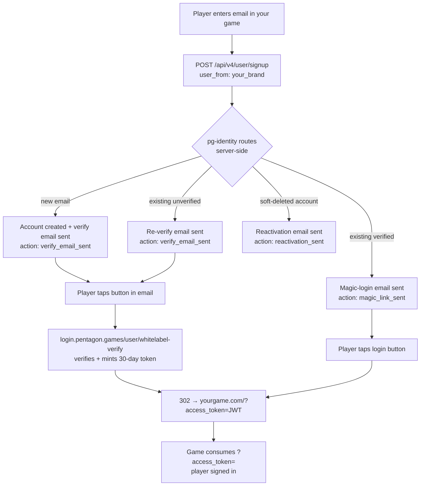

# White-label SSO — login & email verification for Pentagon Games titles

One identity backend, one user database, your game's branding. Players sign up / log in with
**just an email** — no password — directly on your game's page ("powered by Pentagon Games SSO"),
and land back in your game with a session token. Existing Pentagon Games users are auto-detected
and logged into their existing account; brand-new emails become real PG accounts tagged with your
brand key.

**Live reference implementations:** `ar.etherfantasy.com` (EtherFantasy AR, brand `ethermon_ar`)
and `moba.etherfantasy.com` (EtherFantasy MOBA, brand `efmoba`). Frontend drop-in:
[`swissonelabs/ethermon-ar-web` → `/login`](https://github.com/swissonelabs/ethermon-ar-web/tree/main/login)
(framework-free ES modules: `pg-auth.js` + `login-ui.js`).

---

## 0. First thing every new app needs: an App Key

Before anything else, request an **App Key** (`X-PG-App-Key: pk_live_…`) from the Pentagon
identity team. All login/signup calls require it. When requesting, send:

- **App name** (shown in audit logs), e.g. `AR Etherfantasy`
- **Allowed origins** — exact `scheme://host`, **no trailing slash** (`https://ar.etherfantasy.com`,
  not `https://ar.etherfantasy.com/` — a trailing slash causes origin-mismatch warnings)

The app key is frontend-safe (it identifies the app; it is not a secret credential), but treat it
as config, not something to scatter.

## 1. Base URLs

| Purpose | URL |
|---|---|
| All browser/API calls | `https://api.account.pentagon.games` |
| Email landing (server-side redirect, no CORS involved) | `https://login.pentagon.games` |

Your origin must be on the CORS allow-list (part of brand provisioning, section 6).

## 2. The complete flow



Key properties:

- **All routing is server-side.** Your app never checks whether an account exists (that would be
  an enumeration surface). You post the email; pg-identity decides; you display the outcome from
  the `action` field.
- **The game is the landing page.** The verify click verifies the email AND mints the session
  token in one hop — the player is never stranded on a pentagon.games page.
- **Passwordless.** Accounts are created with an auto-generated username/password server-side.
  The player only ever types an email.

## 3. Endpoints you call

| Call | Method & path | Body / notes |
|---|---|---|
| Sign up (new player) | `POST /api/v4/user/signup` | `{email, user_from: "<brand>", from_website}` — captcha-less for approved game brands |
| Magic login (returning) | `POST /user/login/email` | `{email, login_from: "<brand>"}` — always returns `{"status": true}` (anti-enumeration) |
| Captcha (fallback only) | `GET /user/captcha/generate` | returns `{captcha_id, image}` (base64 PNG); only needed after a 429 |
| Who am I | `GET /user/info` | `Authorization: Bearer <token>` → `{result: {id, username, …}}` |
| Wallet info | `GET /user/walletinfo` | Bearer token |

### Signup response contract

| Case | Response |
|---|---|
| New email | `{"status": true, "existing_account": false, "action": "verify_email_sent"}` |
| Existing verified account | `{"status": true, "existing_account": true, "action": "magic_link_sent"}` |
| Existing unverified | `{"status": true, "existing_account": true, "action": "verify_email_sent"}` |
| Existing soft-deleted | `{"status": true, "existing_account": true, "action": "reactivation_sent"}` |
| Rate limit tripped | HTTP `429` `{"status": false, "message": "captcha_required"}` |

**Your UI must branch on `action`** — e.g. `magic_link_sent` → "Looks like you already have a
Pentagon Games account — we emailed you a login link instead." And it must handle the `429` by
showing the captcha stage (fetch `/user/captcha/generate`, retry signup with
`captcha_id` + `captcha_answer`). Never leave the player on a spinner.

### Rate limits (why the 429 exists)

Game brands sign up captcha-free by default; abuse is contained by rate limits instead:
per-email **1 mail / 2 min** and **5 / day**, per-IP 3/hr and 10/day, per-/24 ~20/day. Tripping a
limit demands a captcha — nothing is hard-blocked. Magic-login requests are rate-limited the same
way but **silently** (the endpoint still answers `{"status": true}`; the earlier email remains
valid).

## 4. Consuming the session

Every return link lands on **your registered return URL** with `?access_token=<JWT>`:

```js
// on page load
const u = new URL(location.href);
const t = u.searchParams.get('access_token');
if (t) {
  localStorage.setItem('my_pg_token', t);
  u.searchParams.delete('access_token');
  history.replaceState({}, document.title, u.pathname + u.search + u.hash);
}
```

- Token TTL for game brands: **30 days**. Verify it server- or client-side via `GET /user/info`
  (401/403 → token expired/revoked → clear it and show login again).
- Use `user.id` as your progress-store key. Pentagon identity is **auth only** — it tells you who
  the player is; game state lives in your own backend. Forward the Bearer token to your server and
  re-verify it there via `/user/info`.
- These are **real PG accounts in the shared database**: an existing Pentagon / ChainGuardians /
  Gunnies user logging into your game keeps their identity. Expect most "signups" to be existing
  accounts — design your first-login flow (e.g. cloud-save merge) accordingly.

## 5. Requesting a new white-label brand — the request message

Send this to the Pentagon identity team (or the identity agent session). Copy the template and
fill every field:

```text
WHITE-LABEL BRAND REQUEST — <your game name>

1. brand key            : <snake_case, e.g. mygame_ar>          (immutable, pick carefully)
2. display name         : <e.g. "EtherFantasy AR">              (used in email copy)
3. product URL / origin : https://<host>                        (exact origin for CORS — NO trailing slash)
4. return URL           : https://<host>/<path>                 (where ?access_token= should land)
5. logo                 : attached PNG                          (see logo spec below)
6. email subjects       : verify : <e.g. "Save your pets — confirm your email">
                          login  : <e.g. "Back to your pets — login link">
                          (or "use defaults")
7. captcha-less signup  : yes / no                              (games default: yes, rate-limited)
8. app key              : app name + allowed origins            (if you don't have one yet)
9. cross-sell footer    : one or two lines of plain text        (shown in the text version)
```

### Logo spec

- **PNG, transparent background, ≥512 px wide** (it renders ~76–90 px tall in the email header —
  supply high-res; email clients scale down).
- Light-on-dark or works against a dark header. If your game has a dark-gradient brand palette,
  mention the two hex colors and we match the header gradient.
- The identity team hosts it at `https://pentagon.games/email-assets/<brand>-logo.png` — emails
  must reference hosted HTTPS images, never attachments or base64.
- Your logo goes **on top** as the hero brand. Pentagon Games appears only as the
  **"powered by Pentagon Games SSO"** footer line — that footer is required on all white-label
  templates (it's the trust anchor for the shared account system).

## 6. What the identity team provisions (their checklist)

For transparency — after your request, the identity side sets up:

1. **Email config rows** for your brand key: `auto_login` (return URL = your return URL) and
   `verify_email` / `verify_email_with_creds` (callback = the `whitelabel-verify` landing, which
   then 302s to your return URL). The `auto_login` row's URL is also where verify redirects land —
   one URL drives both.
2. **Two HTML templates**: `magic-link-<brand>.html` and `verify-<brand>.html` (from your logo +
   copy), plus the brand's plain-text identity (display name, site, cross-sell footer — all three
   fields are mandatory in the brand config).
3. **Brand registration** in the white-label set — this is what switches your links to
   `?access_token=` format and enables captcha-less signup.
4. **CORS** allow-list entry for your origin.
5. **App key** with your allowed origins.

Then they send you a test email for review before you go live.

## 7. Email deliverability rules (learned the hard way)

- **Apple recipients (`icloud.com`, `me.com`, `mac.com`) receive the plain-text version** of
  every email — same working login link, no rich HTML. iCloud silently black-holes unwarmed rich
  HTML (accepted at SMTP, never delivered, no bounce). All emails always include a plain-text part.
- **Never test by hammering one mailbox.** ~10 near-identical emails to one address in a day got
  the sender junk-flagged at iCloud, which then retroactively swept the inbox. Rotate test
  addresses; the per-email rate limit (1 / 2 min, 5 / day) also protects you from yourselves.
- Sender is always `identity@pentagon.games` via the Google SMTP relay (SPF/DKIM aligned). Don't
  request per-brand From addresses — brand identity lives in the template and subject.

## 8. Troubleshooting

| Symptom | Likely cause |
|---|---|
| Browser calls fail silently / CORS error | Your origin isn't allow-listed yet, or trailing-slash mismatch in the app key origins |
| Email arrives with generic Pentagon text + `?key=` link | Brand not registered in the white-label set — the request fell through to the legacy PG path; contact the identity team |
| `?access_token=` present but `/user/info` 401 | Token expired (30 d) or account deleted — clear stored token, prompt login |
| Player gets no email | Check the `429` path first (rate limit); then ask the identity team to check the send audit log — every send/failure is logged per-recipient |
| Email in spam / vanished (iCloud) | See section 7 — plain-text policy + mailbox may be flagged; have the user mark "Not Junk" and add `identity@pentagon.games` to contacts |

---

*Maintained by the Pentagon identity/email session. For provisioning requests use the template in
section 5. Last major update: 2026-07-17 (response contract, captcha-on-abuse, Apple plain-text
policy, soft-deleted reactivation routing).*
